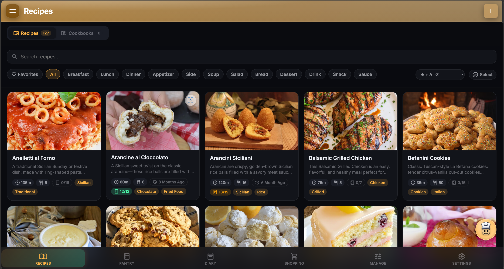
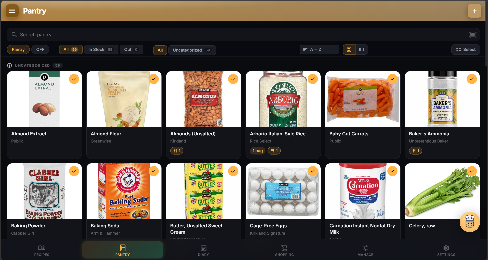
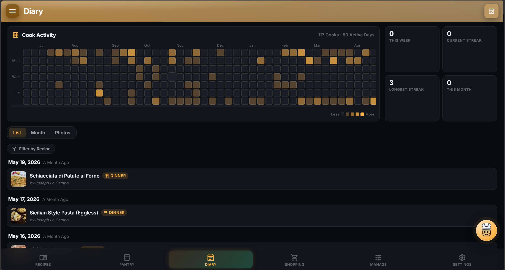
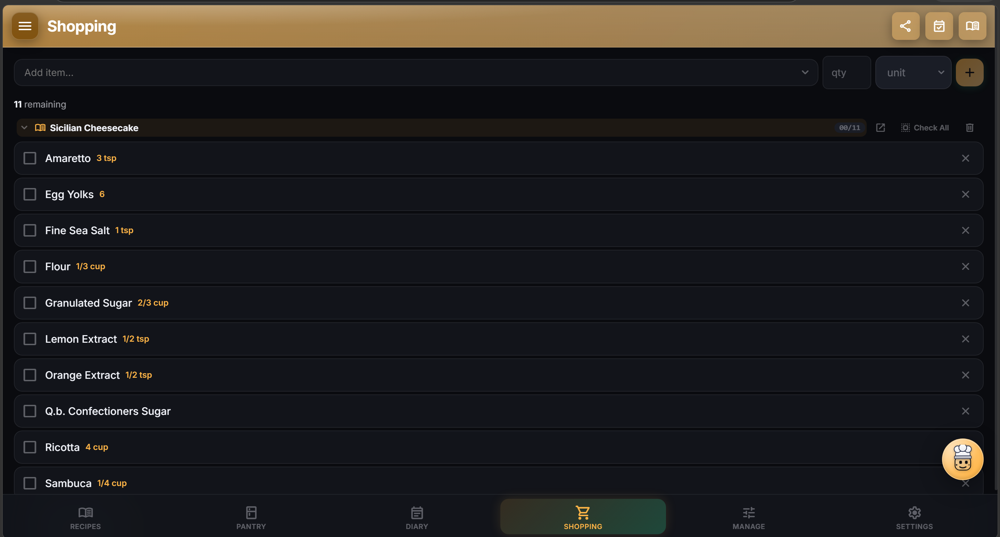
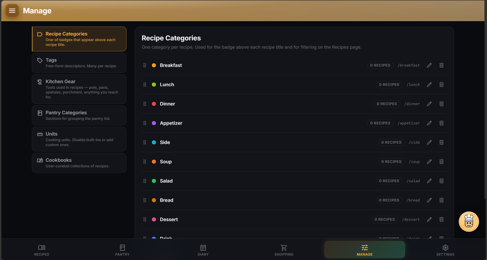
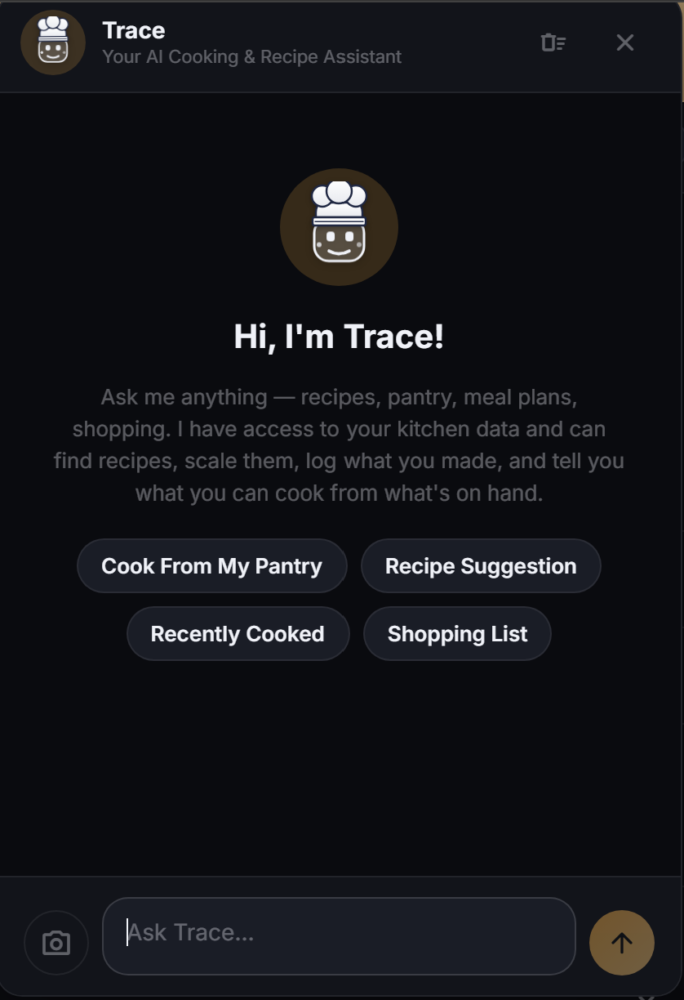

# CookTrace

**Trace Every Recipe, from pantry to plate** — A self-hosted recipe, pantry, and cooking tracker built for privacy and full data ownership.

CookTrace runs as a single Docker container on your own hardware, with a PWA for the browser and a native Android app for your phone. No accounts on external services, no data leaving your network, no subscriptions.

Third app in the Trace family alongside [NutriTrace](https://github.com/traceapps/nutritrace) and [LiftTrace](https://github.com/traceapps/lifttrace).

---

## Principles

- **Self-hosting is and will remain free.** The server, PWA, and source code will never be paywalled.
- **No trackers, no analytics, no telemetry.** CookTrace doesn't phone home — your usage is invisible to anyone but you.
- **Your data stays on your hardware.** No central server, no cloud sync that can read it; nothing leaves your network unless you opt into a third-party integration (Open Food Facts, USDA, an AI provider).
- **Open source under AGPL-3.0.** Every line that touches your data is readable.

---



---

## Features

### Recipes
- Full recipe model: name, hero image, description, star rating, favorite, yield, prep / cook / total time, servings, ingredient groups, step list, kitchen gear, source URL, video URL, rich-text notes
- **Per-step photos** — camera-icon button on each step opens a Camera / Upload / URL picker
- **Step text formatting** — `**bold**`, `*italic*`, `__underline__` inline; time mentions like `15 minutes` become tappable timers
- **Live recipe scaling** — ×0.5 / ×1 / ×2 / ×3 chips plus custom servings; quantities snap to common cooking fractions and render as mixed numbers (`1 ½` not `1 1/2`)
- **Inline unit converter** per ingredient row — convert across tsp / tbsp / fl oz / cup / ml / l / g / kg / oz / lb. Volume-to-grams resolves via the ingredient's linked pantry density first, then a built-in 250-entry density table covering flours, sugars, dairy, fats, vinegars, sauces, spices, vegetables
- **Cook Mode** — Screen Wake Lock, larger fonts, checkbox toggles for ingredients / gear / steps that persist across reloads
- **Cook log** — date + notes + photo per cook event; per-recipe history with edit / delete
- **FDA-style Nutrition Facts box** — 31 nutriments in real label order, %DV column, sodium ↔ salt auto-derive
- **Auto-nutrition recompute** — sums each ingredient's contribution via its linked pantry row; Settings → Recompute Nutrition surfaces missing density hints
- **Sharing** — per-user grants, public-link share tokens, Pinterest-style recipe-card share (SVG), Kitchens (multi-user soft groups for fanning shares out to a whole household at once)
- **Long-press / right-click** any card → action sheet (open, favorite, plan a cook, add to shopping, share card, share link, add to cookbook, share with Kitchen, duplicate, select multiple, delete)
- **Cookbooks** — group recipes into named collections (`Weeknight`, `Holiday`, `Mom's recipes`)
- **Print** — `Cmd-P` on a recipe view yields a clean one- or two-page recipe card. Strips nav, FAB, comments, history, time chips, nutrition box. Keeps hero, name, servings, time, ingredients (left), steps (right), notes

### Recipe Editor
- **Drag-to-reorder** for ingredient rows and step rows
- **Pantry-link button** per ingredient — attach a pantry item's brand / nutrition / stock to the row without renaming what you typed (`salt` stays `salt` with a link to `Iodized Salt`)
- **Add-from-Pantry** picker — bulk-pick existing pantry items straight into the ingredient list
- **Auto-save drafts** — every 1.5s while editing, snapshot to localStorage. Restore-or-discard banner on next open
- **Sticky save bar** — Cancel + Save anchored to the bottom of the viewport
- **Rich-text Notes** — bold / italic / underline / strikethrough + text-color palette + bullet / numbered lists. HTML is sanitized; scripts and event handlers are stripped

### Pantry
- **Slide-up details sheet** — tapping an item opens a bottom sheet (mobile) or centered card (desktop) with hero photo, brand, category, barcode, stock pill, serving size, on-hand quantity, and Nutrition Facts
- **In-place edit** — tap Edit on the sheet, the fields swap to inputs. Photo, name, brand, category, barcode, in-stock, serving size + unit, on-hand qty, notes
- **Inline nutrient editing** — one input row per nutrient in your visibleNutriments setting (default ~10 staples). `Edit all nutrients` opens a stacked sub-sheet with the full 31-nutrient picker
- **Grid + List view modes** — toggle in the filter row; per-user preference syncs across devices
- **Bulk multi-select** — checklist mode, Select All, bulk delete
- **External lookup** — Open Food Facts search + barcode scanner via `@capacitor-mlkit/barcode-scanning` (native) or QuaggaJS (web). Optional USDA FoodData Central search when you enter a key in Settings
- **Catalog grows organically** — opt-in via Settings → Cooking → Auto-add ingredients to Pantry (default off). Manual links from the Link picker always work either way
- **Pantry-match pill** on every recipe card: `8 / 10 in pantry`, color-coded full / partial / none



### Diary (Cook Diary + Meal Planner)
- **List view** — 60 days back / 30 forward, grouped by date
- **Month calendar** — pill-style entries, drag a recipe between cells to re-plan
- **Plan future cooks** — one-tap convert planned → cooked
- **Per-recipe cook history** — every cook event with edit / delete



### Shopping
- **Aisle-grouped list** — quick-add row, optimistic check-off
- **From recipe** — pulls missing ingredients (skips items already stocked in pantry)
- **Bulk clear-checked** plus cross-recipe dedup



### Importers
- **URL Import Engine** — pick per user in Settings → Cooking:
  - **Standard** — schema.org/Recipe JSON-LD parser. Fast, free, works on most major sites. SSRF-guarded fetch
  - **Enhanced** — `recipe-scrapers` Python library (300+ site-specific extractors, falls back to schema.org for unsupported sites via `supported_only=False`)
  - **Smart** — hands the page to your Trace AI for sites that block scrapers or hide content in non-standard markup
- **Photo import** — snap a cookbook page or screenshot; the configured AI provider extracts the recipe
- **Paste / file import** — JSON, HTML, schema.org/Recipe, Mealie / Tandoor / Paprika exports
- **Bulk zip import** — Mealie / Tandoor / Paprika full-backup archives. Cached scan→commit flow: zip uploads once, server caches with a UUID, commit becomes a tiny JSON request. Picker shows thumbnails so you can pick which 10 of 200 to bring across
- **Category carry-over** — every importer that exposes a category (Mealie `recipe_category`, Paprika `categories`, schema.org `recipeCategory` / `recipeCuisine`, CookTrace export) brings the recipe's category through. Default: case-insensitive match → link; miss → auto-create. Per-import toggle to opt out. Tandoor is intentionally skipped because its keyword model conflates tags + categories
- **NutriTrace foods → Pantry** — search your NT food library and bulk-import as pantry items with nutrition + image. Soft-deleted rows resurrect on re-import (no orphan duplicates)

### Manage
- A dedicated catalog page with seven sections: **Recipe Categories**, **Tags**, **Kitchen Gear**, **Pantry Categories**, **Units** (toggle built-ins, add custom), and **Cookbooks**
- Drag-to-reorder, inline edit / delete, recipe-count per row
- Categories carry a color dot used as the badge on every recipe card and as a filter chip on the Recipes list
- New custom units flow through to the unit converter and the recipe scaler



### NutriTrace Federation
- Settings → NutriTrace federation: URL + access token (Bearer, per-user)
- Server proxies every request via `/api/nt/foods`, `/api/nt/log-meal`, `/api/nt/import-foods` so tokens never reach the browser
- Save + Test pattern with a `Connected as <username>` pill on success; failure pill shows the actual NT error inline

### Trace AI Assistant
- **Floating chat FAB** with animated TraceFace mascot (identical asset to NutriTrace + LiftTrace for brand cohesion)
- **Multi-provider** — Anthropic Claude, OpenAI, Google Gemini, or any **OpenAI-compatible** endpoint (Ollama, LM Studio, LocalAI, vLLM, llama.cpp, DeepSeek, Groq, Together AI, OpenRouter). Bring your own API key, or run a local model with no key at all
- **Tool use** across all providers — Trace can read your real data instead of hallucinating numbers. Tools include `get_recipes`, `get_recipe`, `get_pantry`, `find_recipes_from_pantry`, `list_recipe_categories`, `list_pantry_categories`, `get_diary`, `get_shopping_list`, `get_cookbooks`, `get_cookbook`, `log_cook`, `plan_cook`, `add_to_shopping`, `add_to_pantry`, `set_pantry_stock`, `set_pantry_density`, `add_to_cookbook`, `import_recipe_from_url`, `create_recipe`
- **Smart Log** — hold the FAB to record voice; AI parses your sentence and routes intent through the same tools (log a cook, add to shopping, mark something out of stock)
- **Image attach** — paste a photo into the chat (cookbook page, label, pantry shelf) and ask Trace about it
- **Persistent chat** — every turn writes to `ai_chat_history`; on Trace open the last 100 turns load, so conversations travel across browsers and devices for the same user
- **API-key safety** — env-locked installs use the server's `/api/ai/chat` proxy (key never reaches the browser); user-configured installs call providers directly with the user's typed key

<p align="center">
  
</p>

### Multi-user / Auth
- **Wizard onboarding** — local-only or connect-to-server
- **Invite tokens** — admin generates → email or copyable link → user signs up directly into your instance
- **Password reset** — SMTP-backed when configured (env-locked or via Settings UI)
- **OIDC Single Sign-On** — Authentik, Keycloak, Auth0, Authelia, Pocket-ID, Google. Multi-provider admin UI, encrypted client secrets, auto-link verified emails, optional auto-register of new users
- **RP-initiated logout** — when an SSO user signs out, CookTrace also ends the session at the IdP via the standard OIDC end-session endpoint (using `id_token_hint`)
- **Kitchens** — multi-user soft groups for fanning recipe shares out to every member at once
- **Optional Strong Password policy** (admin) — zxcvbn strength checking on top of the standard rules
- **Biometric sign-in on Android** — fingerprint or face, opt-in per device, password remains the always-available fallback

### Branding & Display
- **12 named accent colors** plus a custom HSL / RGB / Hex picker
- **Light / Dark / System** theme
- **Imperial / Metric** measurement system and **kcal / kJ** energy unit (independent — most metric countries still use kcal; AU / NZ defaults to kJ via locale detection)
- **Translations-ready** — English ships; new locales drop in as a single JSON file
- **Page banners** toggle (decorative SVGs at the top of each tab)
- **Persistent sidebar** option on tablets / desktop
- **Skeleton loaders** matching card / row shape on Recipes + Pantry initial load
- **Sticky search + filter row** on the Recipes and Pantry list pages
- **Soft route transitions** — subtle fade + 8px rise between every nav; respects reduce-motion

### Backup & Restore
- **Full backup** (admin only, server mode) — DB + uploads zipped to `uploads/backups/`. Skips `.import-cache` so cached scan zips don't bloat backups
- **Restore** with zip-slip + zip-bomb defenses (5 GB cap, path traversal blocked, dot-prefixed paths skipped on restore so a legacy backup can't repopulate `.import-cache`)
- **Scheduled auto-backups** — pick Off / Daily / Weekly / Monthly with a time-of-day, plus a retention count for how many to keep. Can be policy-locked via `BACKUP_*` env vars for ops-managed deployments
- **Portable JSON** — lighter export (no images) for sharing between accounts
- **Local Full Backup** (Android local mode) — self-contained `.zip` with embedded images for phone-to-phone transfer with no server involved
- **Danger Zone** — Clear all data / Clear all settings (each isolated; one wipes content but keeps prefs, the other vice versa)

### Diagnostics
- **In-app log viewer** — a 500-line in-memory ring buffer captures `console.log/info/warn/error/debug` plus uncaught errors. Toggle Verbose for extra sync / DB detail. View → Copy / Share / Clear
- **Crash report banner** — when an uncaught error fires, a crash log is written; the banner offers Share or Dismiss
- **File logging** (Android only) — last 7 days persisted to disk; Share opens the system share sheet

---

## Apps

### Web (PWA)
CookTrace runs as a Progressive Web App in any modern browser. Add it to your home screen for an app-like, full-screen experience. Requires your CookTrace server to be reachable.

### Android
A native Android app built on the same Svelte codebase, wrapped in Capacitor 8. Use it standalone (fully offline) or connect it to a CookTrace server for sync.

**Install** — download the signed APK from the [Releases page](https://github.com/traceapps/cooktrace/releases/latest) and install on your device. You may need to enable "Install from unknown sources" in Android settings.

**Local mode** — pure offline. SQLite mirrors every server table on-device. The first-launch wizard offers `Use Locally` or `Connect to Server`.

**Connected mode** — differential sync: a 30-second background timer plus a `visibilitychange` resume hook push local changes then pull server changes. Connecting to a server with existing local data shows a merge dialog so you can push local recipes / pantry / diary up and pick which settings win.

### iOS
Not currently available. iOS development requires a Mac, an iPhone, and a paid Apple Developer account.

---

## Self-Hosting with Docker

### Quick Start

1. Download the `docker-compose.yml` from this repo, or copy it directly:

```yaml
services:
  cooktrace:
    image: ghcr.io/traceapps/cooktrace:latest
    container_name: cooktrace
    ports:
      - "3000:3001"
    volumes:
      - ${DATA_DB_PATH}:/data/db
      - ${DATA_UPLOADS_PATH}:/data/uploads
    env_file:
      - .env
    environment:
      - DB_PATH=/data/db/cooktrace.db
      - UPLOADS_PATH=/data/uploads
      - JWT_SECRET=${JWT_SECRET}
      - SMTP_HOST=${SMTP_HOST:-}
      - SMTP_PORT=${SMTP_PORT:-587}
      - SMTP_SECURE=${SMTP_SECURE:-false}
      - SMTP_USER=${SMTP_USER:-}
      - SMTP_PASS=${SMTP_PASS:-}
      - SMTP_FROM=${SMTP_FROM:-}
    restart: unless-stopped
```

The `env_file: .env` directive forwards every variable in your `.env` (including optional ones like `INSECURE_COOKIES` and `RECOVERY_TOKEN`) into the container. The explicit `environment:` block stays as live documentation of the common options. If you want to pin to a specific version, change `latest` to a release tag.

2. Copy `.env.example` to `.env` and fill in your paths:

```env
DATA_DB_PATH=/your/host/path/db
DATA_UPLOADS_PATH=/your/host/path/uploads
JWT_SECRET=your-long-random-secret
```

Generate a JWT secret:
```bash
openssl rand -base64 48
```

3. Start the container:

```bash
docker compose up -d
```

4. Open `http://localhost:3000` in your browser.

On first launch, a setup wizard walks you through enabling user management and creating your admin account. If you skip user management, the app runs in single-user mode with no login required.

### Running on plain HTTP (LAN / dev box)

CookTrace marks auth cookies as `Secure` by default, which means the browser only returns them over HTTPS. If your deployment runs on plain HTTP — a LAN box at `http://192.168.x.x:3000`, a dev VM, a home server with no reverse proxy — login appears to succeed but every subsequent request 401s because the browser silently drops the cookie. You'll see the login screen reappear right after signing in.

The fix: add this to your `.env`:

```env
INSECURE_COOKIES=1
```

This drops the `Secure` flag so the cookie comes back over HTTP. The cookie then travels in cleartext, so use this **only on a trusted network**. Anything internet-facing should put TLS in front instead:

- [Caddy](https://caddyserver.com/) — automatic Let's Encrypt
- nginx + Let's Encrypt
- [Cloudflare Tunnel](https://developers.cloudflare.com/cloudflare-one/connections/connect-networks/) — zero-config public HTTPS
- [Tailscale Funnel](https://tailscale.com/kb/1223/funnel) — same idea via Tailscale

With TLS in front, leave `INSECURE_COOKIES` unset.

---

## Environment Variables

| Variable | Required | Default | Description |
|---|---|---|---|
| `DATA_DB_PATH` | Yes | — | Host path for the SQLite database directory |
| `DATA_UPLOADS_PATH` | Yes | — | Host path for uploaded images and backups |
| `JWT_SECRET` | If using users | — | Secret key for signing auth tokens. Use a long random string |
| `TOKEN_ENC_KEY` | No | derived from `JWT_SECRET` | At-rest encryption key for OIDC client secrets and federation tokens. Set this if you want to rotate `JWT_SECRET` without invalidating stored secrets |
| `RECOVERY_TOKEN` | No | — | Passphrase required to disable user management from the login page (lockout recovery). Without this the recovery endpoint is disabled |
| `INSECURE_COOKIES` | If on plain HTTP | unset | Set to `1` to drop the `Secure` flag on auth cookies. Required on plain HTTP. Use only on trusted networks |
| `BASE_URL` | No | — | Mount the app at a subpath instead of root (e.g. `/cooktrace` for `https://host/cooktrace/`) |
| `PORT` | No | `3001` | Port the server listens on inside the container |
| `LOG_LEVEL` | No | `info` | Log verbosity: `error` \| `warn` \| `info` \| `debug` |
| `MAX_SESSION_HOURS` | No | `8760` | Cap session length in hours (default 1 year). Lower for shared / kiosk machines |
| `IMPORT_ZIP_MAX_MB` | No | `256` | Cap upload size for bulk Mealie / Tandoor / Paprika import zips |
| `BACKUP_UPLOAD_MAX_MB` | No | `1024` | Cap upload size for `Upload & Restore` of a full-backup ZIP |
| `BACKUP_SCHEDULE` | No | — | Auto-backup cadence: `off` \| `daily` \| `weekly` \| `monthly`. Locks the UI fields when set |
| `BACKUP_TIME` | No | `02:00` | Auto-backup time of day (HH:MM, container timezone). Locks the UI field when set |
| `BACKUP_RETENTION` | No | — | How many auto-backups to retain (older ones purged). Locks the UI field when set |
| `SMTP_HOST` | No | — | SMTP server hostname (for password reset & invites) |
| `SMTP_PORT` | No | `587` | SMTP port |
| `SMTP_SECURE` | No | `false` | `true` for SSL (port 465), `false` for STARTTLS |
| `SMTP_USER` | No | — | SMTP username |
| `SMTP_PASS` | No | — | SMTP password |
| `SMTP_FROM` | No | — | From address, e.g. `CookTrace <noreply@example.com>` |
| `AI_PROVIDER` | No | — | Lock Trace to a specific provider for all users: `claude` \| `openai` \| `gemini` |
| `AI_API_KEY` | No | — | Shared AI API key. Server-side only — never sent to the browser |
| `AI_MODEL` | No | provider default | Override the AI model (e.g. `claude-haiku-4-5-20251001`) |
| `AI_ENABLED` | No | — | Set to `true` to auto-enable Trace for all users |
| `OIDC_*` | No | — | OIDC SSO provider config; see Single Sign-On below |

SMTP and AI settings can also be configured in the Settings UI. Environment variables take priority over UI values and lock those fields for all users. Without SMTP configured, invites fall back to a copyable link instead of email.

---

## Data Persistence

Two host directories must be bind-mounted:

- **Database** (`DATA_DB_PATH`) — SQLite file. Survives container restarts and redeployments.
- **Uploads** (`DATA_UPLOADS_PATH`) — Recipe / pantry / cook photos, share cards, and server-side backups (stored in `uploads/backups/`). Survives container restarts and redeployments.

Nothing else needs to persist — the container is stateless beyond these two volumes.

---

## Updating

```bash
docker compose pull
docker compose up -d
```

The database schema migrates automatically on startup.

Docker images are built multi-architecture (linux/amd64 + linux/arm64) so the same `docker compose pull` works on x86 hosts, Raspberry Pi 4 / Pi 5, Apple Silicon servers, and ARM-based cloud instances.

---

## Tech Stack

| Layer | Technology |
|---|---|
| Frontend | Svelte 5 (compat mode), svelte-spa-router 4, Vite 7, PWA (vite-plugin-pwa / Workbox) |
| Mobile | Capacitor 8 (Android), `@capacitor-community/sqlite` for offline storage, ML Kit barcode scanning |
| Backend | Node.js, Express 5, better-sqlite3 11 |
| Server-side import | `recipe-scrapers` Python library, bridged via `python3 -c` (baked into the Docker image) |
| Auth | JWT (httpOnly cookie), bcryptjs, OpenID Connect 1.0 (PKCE + state + nonce) |
| Container | Docker, multi-stage Dockerfile, multi-arch (amd64 + arm64) |
| CI/CD | GitHub Actions → GitHub Container Registry |

---

## API Integrations

All external API calls are proxied server-side — no keys are exposed to the browser.

- **[Open Food Facts](https://world.openfoodfacts.org/)** — free barcode / food search (no key required)
- **[USDA FoodData Central](https://fdc.nal.usda.gov/)** — optional US food database (free API key, configured per-user in Settings)
- **[NutriTrace](https://github.com/traceapps/nutritrace)** — federate with a NutriTrace instance to pull foods directly and (optionally) log cooked recipes back to its diary
- **AI provider** — your choice of Claude, OpenAI, Gemini, or any OpenAI-compatible endpoint

---

## Single Sign-On (OIDC)

Optional. Connect any OpenID Connect 1.0 compliant identity provider — **Authentik**, **Keycloak**, **Authelia**, **Pocket ID**, **Auth0**, **Google**, etc. — to sign in with credentials your IdP already manages. Existing password login keeps working alongside SSO; admins can also disable password login entirely once SSO is set up.

**Prerequisite**: User Management must be enabled and you must be signed in as an admin. If your instance is single-user, run **Settings → User Management → Set Up** first to create your admin account.

**Two ways to configure**:

1. **UI** (admin-only): **Settings → Authentication → OIDC providers**. Has a card picker for common IdPs that pre-fills sensible defaults. Enter your provider's `issuer URL`, `client ID`, and `client secret`, save, then test discovery with the network-check button before letting users sign in.

2. **Environment variables** (for IaC / docker-compose / k8s deployments):

   ```env
   # Single provider — most common case
   OIDC_ISSUER=https://auth.example.com
   OIDC_CLIENT_ID=cooktrace
   OIDC_CLIENT_SECRET=...
   OIDC_DISPLAY_NAME=Authentik

   # Optional fields (per-provider)
   OIDC_SCOPE=openid profile email
   OIDC_ADMIN_GROUP_CLAIM=groups
   OIDC_ADMIN_GROUP_VALUE=CookTraceAdmins
   OIDC_AUTO_LINK=1
   OIDC_AUTO_REGISTER=0

   # Multi-provider — use numbered prefix instead
   OIDC_PROVIDER_2_ISSUER=https://other-idp.example.com
   OIDC_PROVIDER_2_CLIENT_ID=...
   OIDC_PROVIDER_2_CLIENT_SECRET=...
   OIDC_PROVIDER_2_DISPLAY_NAME=Keycloak
   ```

   `OIDC_*` (unnumbered) is an alias for `OIDC_PROVIDER_1_*`. Env-defined providers show with a lock badge in the Settings UI and are read-only.

**Per-provider toggles**:
- **Auto-link existing users (verified email)** — when the IdP says `email_verified=true` and the email matches an existing CookTrace user, link them silently on first SSO sign-in. Defaults ON.
- **Auto-register new users** — let anyone with an account at the IdP create a brand-new CookTrace account on first sign-in. Defaults OFF.
- **Admin group claim / value** — optionally elevate users to admin based on a claim. E.g. claim `groups` containing value `CookTraceAdmins`. Re-evaluated on every sign-in.

**Mobile**: Android in server-connected mode supports SSO too. The app opens the IdP authorize URL in Chrome Custom Tabs; the IdP redirects back via the `cooktrace://oidc-callback/` deep link, the app intercepts it and signs you in.

**Logout (RP-initiated)**: register two Post Logout Redirect URIs at your IdP so the IdP session is also ended on sign-out:
- `https://your-cooktrace-host/` for PWA logouts
- `cooktrace://oidc-callback` for Android logouts

If the IdP doesn't expose an `end_session_endpoint`, logout falls back to a local-only clear.

---

## Federation with NutriTrace

CookTrace can federate with a NutriTrace instance you (or someone you trust) runs. Configure it in **Settings → Connected Services → NutriTrace Federation**:

1. Paste your NutriTrace URL
2. Paste a per-user access token generated in NutriTrace (Settings → API Access)
3. Click **Test** — the badge flips to `Connected as <username>` when it round-trips

What it unlocks:
- **Pantry → NT food picker** — search your NT food library inside CookTrace's pantry tab and bulk-import as pantry items with nutrition + image carried across
- **Recipe ingredient → NT food** — link an ingredient row to an NT food for accurate nutrition without a local pantry row
- **Log a cook → NT diary** — when you mark a recipe as cooked, optionally fan out one diary entry per serving to NutriTrace

Tokens never reach the browser — every federated request goes browser → CookTrace server → NutriTrace.

CookTrace works fully standalone without federation.

---

## Local Dev

```bash
npm install
npm run dev          # Vite dev server on :5175
node server/index.js # API on :3001
```

The dev server proxies `/api` to `:3001` so the same fetch paths work in dev and prod.

---

## Translations

CookTrace ships with English (`en`) translations. Pick your active language from **Settings → Regional & Units → Language** — the change is reactive (no reload needed).

**Want to contribute a translation?** It's a single JSON file:

1. Copy `src/i18n/en.json` to `src/i18n/<your-locale>.json` (e.g. `fr.json`, `de.json`, `pt-BR.json`).
2. Translate the values, leave the keys untouched. HTML / Markdown inside values (e.g. `<strong>`, `<code>`, `<br>`) stays as-is.
3. `npm run i18n:check` reports per-locale coverage.
4. Open a PR.

---

## Troubleshooting

If you're filing a bug, logs make it 10× faster to fix.

**In-app logs** (PWA + Android — recommended): **Settings → Diagnostics → View logs.** A 500-line ring buffer captures `console.log/info/warn/error/debug` plus uncaught errors. Toggle **Verbose** to capture extra import / sync / AI detail. The viewer has Copy / Share / Clear — Share opens the system share sheet on Android, Web Share API on PWA.

**Server logs** (Docker):
```bash
docker logs cooktrace --tail 200
```
For deeper diagnosis, set `LOG_LEVEL=debug` in your `.env` and restart.

**Where to file**: [github.com/traceapps/cooktrace/issues](https://github.com/traceapps/cooktrace/issues).

---

## Support

CookTrace is free to self-host and always will be. It's built and maintained by one person; donations help cover real costs (Apple Developer account for an eventual iOS port, hosting, hardware). Starring the repo helps with discoverability and costs nothing.

[](https://ko-fi.com/traceapps)

---

## Disclaimer

CookTrace is not medical, health, or nutrition-professional software. It does not provide medical advice, diagnosis, treatment, or personalized nutrition prescriptions. Recipe entries, pantry tracking, AI-extracted nutrition, Trace AI suggestions, Smart Log parsing, and any analytical output are for informational and self-tracking purposes only.

Nutrition decisions can interact with medical conditions (diabetes, eating disorders, food allergies, pregnancy, breastfeeding, pediatric needs, kidney or liver disease, metabolic disorders) in ways this app cannot assess. Consult a qualified healthcare professional, registered dietitian, or licensed nutritionist before starting a new eating plan or making significant dietary changes.

Trace AI answers can be incorrect or incomplete; treat them as a starting point, not a substitute for human judgment or professional advice. Recipe and food nutrition data from third-party sources (Open Food Facts, recipe websites, schema.org markup, AI photo extraction) is community-curated and may contain inaccuracies. **Use at your own risk.**

---

## License

[AGPL-3.0](LICENSE) — entire codebase including the Android app source.
